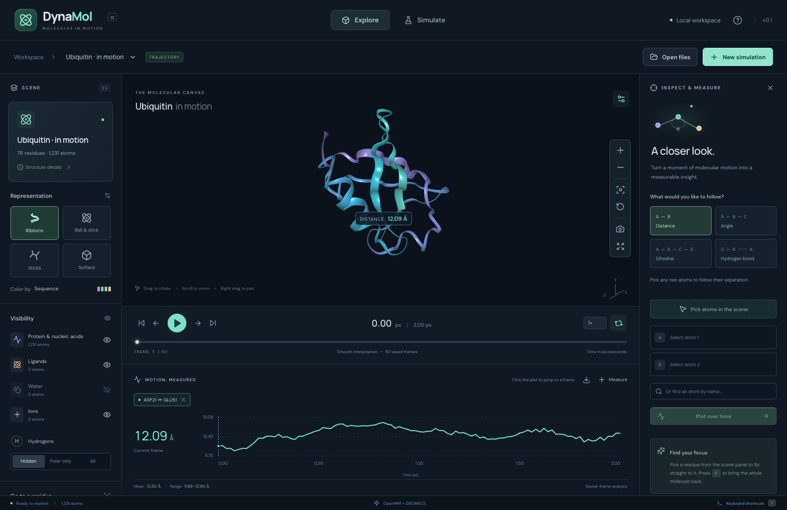

# DynaMol

**Molecules in motion.** A local, open source molecular dynamics workbench: create a trajectory, explore it in 3D, and follow the interactions that matter.



DynaMol is a working **v0.1 alpha**, built with React, NGL, FastAPI, MDTraj, OpenMM, GROMACS, PDBFixer, RDKit, and AmberTools. It runs on your own computer. Uploaded coordinates and simulations stay local. Optional Fetch contacts RCSB or PubChem; ligand inspection can also retrieve public Chemical Component Dictionary (CCD) records from RCSB using component identifiers. The application needs no cloud account or API key. Fonts and the starter trajectory are bundled for offline use after dependencies are installed.

## Start exploring

For the local **Apple Silicon/macOS 14+ prototype**, open the self-contained `DynaMol.app` from `build/releases/DynaMol-0.1.0-macos-arm64.zip`. It includes Python, OpenMM, GROMACS and AmberTools; first launch unpacks the included engines with a progress display. No separate engine installation is needed. This local build is not Apple Developer signed or notarized; clean-machine testing and public redistribution materials remain release work. See [package instructions](packaging/README.md).

To run or develop from source:

Install [Node.js 22+](https://nodejs.org/) and [uv](https://docs.astral.sh/uv/getting-started/installation/), then run:

```bash
./start.sh
```

Open **http://127.0.0.1:8765**. The launcher installs locked Python dependencies, builds the frontend, and restores the bundled example into a fresh workspace. On macOS, double-click **DynaMol.command** to launch and open the browser. Keep the terminal running while using the app. Simulation workers are separate processes and can continue when you close the browser or stop the web server; reopen the app to see their progress or cancel them.

The initial scene contains a **real 2 ps OpenMM trajectory of ubiquitin**: 101 saved frames, 1,231 atoms, Amber ff14SB/GBn2, 300 K. Press Play or Space. A real Cα distance trace is ready to explore below the timeline. Its 3D annotation starts hidden: click the eye on its plot tab or the viewer toolbar to show it. The eye preserves the plot; × removes the measurement. This short run demonstrates the software; it does not establish equilibration, convergence, or a biological conclusion.

### Enable GROMACS

OpenMM installs with the Python dependencies. GROMACS is a separate optional native dependency. Install a compatible `gmx` executable and put it on PATH, or use a project-local Conda environment:

```bash
conda create -p .gromacs -c conda-forge gromacs=2025.4 -y
```

DynaMol also accepts `DYNAMOL_GMX=/absolute/path/to/gmx`. The current workspace already has **OpenMM 8.6 and GROMACS 2025.4** installed and tested. Availability and engine versions appear in Simulation Studio.

### Enable protein–ligand preparation

Install [Miniforge](https://github.com/conda-forge/miniforge), or use an existing `conda`/`mamba` installation, then run:

```bash
./scripts/install_ligand_tools.sh
uv sync --frozen
```

The script creates a private **AmberTools 24.8** environment under `.tools/ambertools` and records the resolved packages in `.tools/ambertools-explicit.txt`. It supplies Antechamber/SQM, GAFF2, `parmchk2`, and LEaP; DynaMol's Python environment supplies ParmEd, Gemmi, and Dimorphite-DL. Alternatively, set `DYNAMOL_AMBERTOOLS` to an existing complete AmberTools installation. Protein-only preparation remains available without AmberTools.

The first inspection of an unfamiliar PDB ligand may need internet to retrieve its CCD definition. Records are cached in `data/chemistry/ccd` (under `DYNAMOL_DATA_DIR` when configured). Previously prepared complexes retain their parameter files and do not need a fresh charge calculation to run OpenMM. The [standalone prototype](docs/PACKAGING.md) includes the native runtimes; the installation commands above apply to the source checkout.

## Inside the workbench

**Keep your workspace.** DynaMol automatically restores your molecule, camera, frame, display settings, measurements and named selections. **Projects** saves named snapshots and exports portable backups with the required molecular files and parameter records. The molecule library supports search, rename, archive and recoverable trash. See [workspaces and backups](docs/WORKSPACES.md).

**Explore.** Ribbons by default, with ball-and-stick, sticks, and molecular surface views. Rotate by dragging, zoom with a pinch, wheel or explicit buttons, pan with right-drag, and focus on a residue by name or number. Show or hide proteins/nucleic acids, ligands, waters, ions, all hydrogens, or only polar hydrogens. Save the scene as a PNG. Fullscreen includes the top toolbar and dialogs. Short or interrupted protein fragments are shown as atoms when a ribbon cannot be drawn.

In ribbon view, **Polar only** retains a light trace of the full heavy-atom structure with attached polar hydrogens; non-polar hydrogens are hidden. **All** adds the remaining hydrogens, and **Hidden** returns to the ribbon view.

**Play.** Frame stepping, scrubbing, looped playback, variable speed, and a linked timeline. Nonperiodic trajectories use interpolated visual transitions without changing saved coordinates. Periodic trajectories currently play saved frames, avoiding interpolation across box discontinuities. The camera is preserved throughout playback.

**Measure.** Pick two atoms for distance, three for an angle, or four for a signed dihedral. The current value appears in the scene and inspector as soon as the selection is complete, without creating a plot. Pick donor–hydrogen–acceptor for a geometric hydrogen-bond trace and occupancy. Atom search supplements direct 3D picking. Plots use actual timestamps, support click-to-seek, and export CSV; torsion summaries use circular statistics. Measurements come from original saved coordinates with minimum-image periodic geometry when valid box data exists. Interpolation and display alignment do not affect the calculated values.

**Analyze.** Expand **Structural analysis** below the measurement plot for RMSD and RMSF. Choose the atoms, fit, reference, frame window and periodic handling. Named selections are available here. Click RMSD to seek a frame or RMSF to select a residue; download CSV values and an analysis record containing the exact settings and atom indices. See [analysis and diagnostics](docs/ANALYSIS.md).

**Prepare.** Open Simulate to upload a PDB, mmCIF, MOL2, SDF or SMILES file, fetch a PDB accession or PubChem molecule, or paste SMILES to generate a local 3D conformer. Each result loads immediately beside the controls. **Prep protein** repairs missing protein atoms, rebuilds hydrogens for the selected pH, and samples side-chain clashes. With ligands present, the action becomes **Prep complex**: it retains their bound poses, assigns documented molecular states and actual GAFF2/AM1-BCC parameters, and keeps supported ions and observed metal-coordinating waters. Inspect each ligand's selected SMILES and charge; an explicit-state SMILES override is available when a different state is needed.

Inspection warns about missing sequence and backbone gaps; known short internal loops can be built with an explicit checkbox. Protein-only preparation can perform backbone-restrained local relaxation. Complexes are minimized after explicit solvation, avoiding an unsupported implicit ligand model. The resulting structure, settings, ligand files and warnings are saved as a separate dataset.

The Prep button spins immediately. A monitor above the scrolling controls shows the current stage, completed-stage percentage, elapsed time, cancellation and logs. It reconnects when the studio is reopened and distinguishes a completed preparation from a structure still loading in the viewer. Errors stay visible, with an Open result action to retry a failed display load.

**Solvate.** After preparation, select **Explicit water**. A background job builds an actual TIP3P box, displays water and ions, and saves the system. OpenMM reuses those coordinates, protonation states and ligand parameters. Update box applies the chosen padding. Prepared protein–ligand complexes require explicit water; implicit solvent remains a protein-only option. A solvent preview has not been equilibrated.

**Simulate.** Choose OpenMM or GROMACS, configure temperature, duration, solvent and optional advanced settings, then start a real local job. Follow stages, step counts, progress and logs while exploring another trajectory. Cancel a running job, open the completed result, or download its files with configuration, seed, versions, provenance, and engine output.

Readiness panels explain known chemistry and resource blockers before starting, including estimated system size, saved frames and disk use. Native energy and temperature plots appear as the engine records observations. Compatible stopped or interrupted dynamics can **Resume** from a validated checkpoint, retaining the same run and existing frame prefix; incompatible or missing checkpoints receive a specific explanation. See [checkpoint recovery](docs/CHECKPOINT_RECOVERY.md).

### File support

| Input | Supported formats |
| --- | --- |
| Simulation structure | PDB, mmCIF, MOL2, SDF/MOL, SMILES; RCSB/PubChem fetch |
| Trajectory topology | PDB, mmCIF, GRO, MDTraj HDF5 |
| Trajectory | XTC, DCD, TRR, NetCDF, multi-model PDB, MDTraj HDF5, MDCRD, LAMMPS text, XYZ |
| Exports | PNG scene, CSV measurements/RMSD/RMSF/diagnostics, analysis JSON, simulation output ZIP, project backup ZIP |

Topology and trajectory must have identical atom ordering. Self-describing trajectories undergo atom-identity checks; binary formats only allow atom-count validation. Original uploads and hashes are retained. If a reader cannot supply trustworthy timing, DynaMol labels its axis as frame indices; enter an interval in picoseconds during import to provide physical time. The interval is per original frame, before stride.

Imports are limited to **250 MiB per file**, **100,000 atoms**, **10,000 retained frames**, and **256 MiB of retained coordinates**. The browser receives the retained coordinate buffer in full. Use import stride or trim large trajectories externally. This alpha does not yet stream multi-gigabyte trajectories.

The Simulate structure loader accepts one molecule per SDF/SMILES file and one MOLECULE block per MOL2, with a 25 MiB source limit and a 500-atom limit for RDKit small molecules. MOL2 requires explicit supported Tripos atom/bond types and contiguous residue atom blocks; protein residues also need recognizable backbone atom names. Chemical connectivity, charges and original files are retained. Importing or generating a ligand only loads its structure; **Prep complex** assigns MD parameters for ligands already present with a protein. This alpha does not dock or merge a separately loaded ligand into a protein.

### Keyboard shortcuts

| Key | Action |
| --- | --- |
| Space | Play / pause |
| ← / → | Previous / next frame |
| F | Fit molecule |
| M | Toggle atom picking |
| Esc | Clear picking / close dialog |
| ? | Quick guide |

## Simulation scope

Automatic preparation supports **standard amino-acid proteins, SEP/TPO/PTR/HYP modifications, and supported noncovalent protein–ligand complexes**. Ligands are retained by default. An unknown chemical graph, missing ligand heavy atoms, unsupported element, covalent ligand linkage, or unassigned force-field term produces a component-specific error; source molecules are not silently removed. Other unnatural residues are recognized and retained, with a specific template blocker; this does not provide parameters for every unnatural amino acid. Nucleic acids require another preparation workflow.

The [chemistry support matrix](docs/CHEMISTRY_SUPPORT.md) records checks across all 20 standard amino-acid types, representative charge states, termini/caps, disulfides, organic ligands, ATP/ADP/NAD/FAD and Na+/Cl−/K+/Mg2+/Ca2+. Heme, covalent cofactors, other metal states and unregistered unnatural amino acids still need specialized validated templates. Loading these structures remains separate from eligibility for MD preparation.

- **OpenMM:** ff14SB with GBn2 implicit solvent, or TIP3P explicit solvent with PME. Langevin-middle, hydrogen-bond constraints, up to 2 fs integration steps. Implicit mode requires a protein-only input.
- **Protein–ligand OpenMM:** ff14SB protein + GAFF2/AM1-BCC organic ligands + TIP3P-compatible Amber ions/water. Each ligand is limited to 200 heavy atoms and supported closed-shell organic chemistry. Bound heavy-atom coordinates are preserved during preparation. XML templates, atom mappings, native charge/parameter files and logs remain attached through solvation and dynamics.
- **Modified residues:** SEP, TPO and PTR use fixed −2 phosaa14SB states; HYP uses neutral internal ff14SB HYP or −1 C-terminal CHYP. Compatible terminal forms and covalent connectivity are checked. Their peptide links, heavy-atom chemistry, stereochemistry and parameter hashes are preserved; OpenMM explicit water is required. See [supported states and native validation](docs/MODIFIED_RESIDUES.md). MSE, ALY and other unregistered modifications currently require additional validated templates.
- **GROMACS:** Amber99SB-ILDN/TIP3P, PME, stochastic dynamics, hydrogen-bond constraints, explicit solvent. Hydrogen reconstruction is recorded; existing heavy atoms are retained. Neutralizing ions replace only newly added solvent.
- Both engine presets use **fixed-volume NVT**, optional minimization, and a short initial relaxation. They do not include pressure equilibration, site-specific pKₐ prediction, production convergence assessment, or GPU selection. Different engine defaults are not equivalent physical protocols.
- Prepared structures and solvent previews currently run with **OpenMM**. GROMACS transfer is explicitly blocked because its preset rebuilds hydrogen states and uses a different force field; unprepared standard-protein inputs retain the original GROMACS workflow.
- Missing-loop building is limited to sequence-supported internal gaps of at most 6 residues each and 12 residues total. Terminal extensions and larger gaps require external modeling. PDBFixer loop coordinates and bounded side-chain sampling are starting models, not validated native conformations. Ionization uses pH/template heuristics; existing hydrogens are removed before rebuilding at a new pH. Rebuilt/relaxed structures undergo template-based stereochemistry checks; invalid models are rejected.
- Ligand protonation uses documented empirical rules and an editable fixed state, not a binding-site pKₐ or tautomer-population prediction. Unsupported amide/N–N protonation proposals retain the source state with a warning. A reference GNP −4 state is used at pH 6–8 unless overridden. Metal ions use a nonbonded approximation; retaining their coordinating waters and donor geometry does not validate coordination energetics.
- One simulation, preparation or solvation job runs at a time, using two CPU threads by default. Set `DYNAMOL_CPU_THREADS` to 1–4. Progress reflects completed production steps; preparation stages do not have a fabricated percentage.

The hydrogen-bond tool reports a **custom geometric criterion**: donor–acceptor ≤ 3.5 Å and donor–H–acceptor ≥ 150°, with explicit hydrogen connectivity required. This is not proof of chemical donor/acceptor eligibility or equivalence to other packages' default definitions.

See the [complex preparation review](docs/complex-preparation-review.md), [protein preparation review](docs/preparation-review.md), and [scientific review](docs/scientific-review.md) for validation status and limitations, and [backend notes](backend/README.md) for exact behavior. A completed preparation or short MD test is not evidence of an experimentally correct protonation state, ligand binding, or equilibrium sampling. The first bundled demo has an explicitly recorded preparation-randomness limitation; new jobs seed preparation as well as dynamics.

## Develop and contribute

```bash
./start.sh --dev                         # API 8765 + Vite 5173
.venv/bin/python -m pytest -q            # Backend tests
npm --prefix frontend run build         # TypeScript + production build
cd frontend                            # See TESTING.md for isolated browser tests
```

Browser tests require Google Chrome and a disposable data root on a dedicated test port. They restore a known demo scene before each case and create real datasets/jobs. Follow [the isolated test instructions](frontend/TESTING.md); the suite refuses normal user-facing ports.

The [UI functional audit](docs/UI_FUNCTIONAL_AUDIT.md) records exercised controls, real-canvas checks, format fixtures, defects and the current browser-test results. The [complex preparation review](docs/complex-preparation-review.md) records native ligand validation and a bounded OpenMM continuity run. The full prepared 9AX6 structure is retained, but its complete explicit-water box exceeds the alpha's 100,000-atom cap; the documented native MD check uses one complete observed complex selected from its two copies.

```text
frontend/src/        React interface, NGL viewer, plots, import & simulation panes
backend/             FastAPI API, persistent jobs, native engine workers, analysis
examples/            Bundled real demo and its provenance
scripts/             Bootstrap and optional demo regeneration
docs/                API contract, numerical audits, review and screenshots
data/                Local uploads, trajectories and jobs (gitignored)
```

The production UI is served by FastAPI at the same localhost origin. The API reference is available at `/docs`. Use one backend process. `DYNAMOL_DATA_DIR` changes the data location; environment settings are illustrated in `.env.example`.

To regenerate the example with the current preparation pipeline:

```bash
.venv/bin/python scripts/generate_demo.py --force
```

This downloads public PDB 1UBQ if necessary and starts a short real CPU simulation. It explicitly selects protein for the implicit-solvent demo and records the excluded crystallographic waters. Regeneration replaces the local `demo` dataset; ordinary uploads are unaffected.

Good next contributions: bounded trajectory streaming, verified continuous periodic display paths, validated prepared-state transfer to GROMACS, broader ligand and metal models, GPU controls, contact maps, and accessible atom tables for very large structures. Please include representative molecular files or reproducible fixtures with format/analysis changes, and preserve the separation between display coordinates and physical analysis.

## Credits and license

DynaMol application code is [MIT licensed](LICENSE). Dependencies retain their own licenses; see [third-party notices](THIRD_PARTY.md). The starter structure is [RCSB PDB 1UBQ](https://www.rcsb.org/structure/1UBQ), from Vijay-Kumar, Bugg & Cook, *Journal of Molecular Biology* (1987), [doi:10.1016/0022-2836(87)90679-6](https://doi.org/10.1016/0022-2836(87)90679-6).
