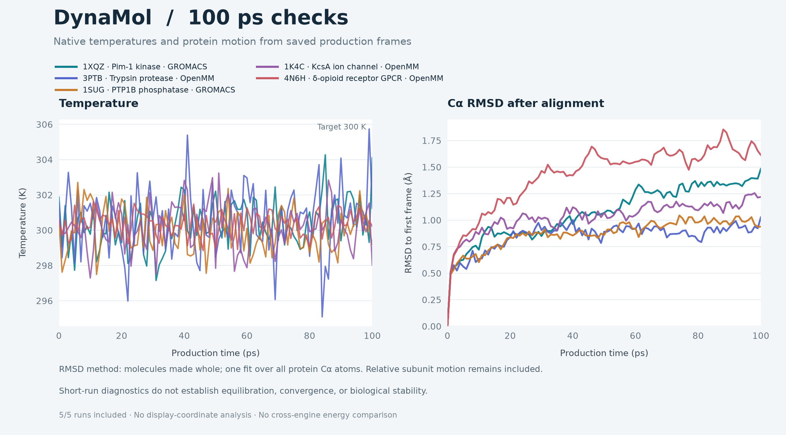

# DynaMol five-system pressure test

**Five systems completed 100 ps and passed their native-output and browser checks: three OpenMM and two GROMACS runs. The original 4BVN GPCR case failed stereochemistry checks; the complete 4N6H construct supplied the successful replacement.** These are explicit-water software tests on benign public structures, not validation of physiological dynamics. All five completed results are available as named Projects in the main app, each with three saved plots; [delivery readback](main-app-five-results.json) confirmed all 101-frame datasets and coordinate downloads while preserving the current workspace. This report is an evidence synthesis by a language model, not professional certification.

| Class / input | Resolution | Engine | Solvated atoms | Run wall time | Production result |
|---|---:|---|---:|---:|---|
| Kinase · [1XQZ](https://www.rcsb.org/structure/1XQZ), Pim-1 | 2.10 Å | GROMACS | 54,537 | 8.6 min | 100 ps, 101 frames; native and browser checks pass |
| Protease · [3PTB](https://www.rcsb.org/structure/3PTB), trypsin–benzamidine | 1.70 Å | OpenMM | 27,365 | 17.9 min | 100 ps, 101 frames; native and browser checks pass |
| Phosphatase · [1SUG](https://www.rcsb.org/structure/1SUG), PTP1B | 1.95 Å | GROMACS | 65,556 | 15.7 min | 100 ps, 101 frames; native and browser checks pass |
| Ion channel · [1K4C](https://www.rcsb.org/structure/1K4C), KcsA tetramer | 2.00 Å | OpenMM | 56,502 | 29.0 min | 100 ps, 101 frames; native and browser checks pass |
| GPCR replacement · [4N6H](https://www.rcsb.org/structure/4N6H), δ-opioid receptor–BRIL | 1.80 Å | OpenMM | 145,913 | 73.9 min | 100 ps, 101 frames; native and browser checks pass |

The five completed runs produced finite coordinates and recorded energies/temperatures, readable native trajectories, consistent saved times, and matching live/offline distance, angle and dihedral measurements. The shared validators passed 15 checks per GROMACS case and 20 each for trypsin/channel and 21 for the replacement GPCR; native GROMACS readers and independent NumPy geometry checks supplied additional evidence. [Browser results](browser-summary.json) are **5/5 passed**, covering actual job-to-Explore loading, all 101 frames, playback/pause, endpoint scrubbing, saved and newly calculated plots, water visibility, zoom and native ZIP downloads. There were no browser/console errors or simulation-control requests. Separate checks passed all 101 frames for [the first four systems](completed-stereochemistry-validation.json), [439 GPCR protein centers](gpcr-4N6H-stereo-frames-validation.json), and [all four defined ligand carbon centers](gpcr-4N6H-EJ4-stereo-validation.json). The GPCR also passed eight [solute/charge/bond/Na continuity checks](gpcr-4N6H-output-continuity.json) and three [independent NumPy geometry comparisons](gpcr-4N6H-numpy-geometry.json). Two native legacy-PDB numbering-inference warnings were [recorded](gpcr-4N6H-execution-summary.json); the independent atom identities/counts and coordinate checks passed without solute atom loss. [The final scoped backend suite](backend-regressions-final.json) passed **265 tests with nine recorded warnings** in 17.33 seconds; the earlier [155-test record](backend-regressions.json) remains preserved. Native runs used their recorded launch-time code. The final regression suite covers later changes to diagnostic history, failure CIF files and recovery; the long native runs were not rerun with those later source hashes. [GPCR provenance](gpcr-4N6H-executed-code.json) explicitly distinguishes its launch-time worker from the later frozen worker.

The [trace data and analysis method](pressure-test-summary.json) include only completed runs. Protein Cα RMSD uses one proper rigid fit after making bonded molecules whole under periodic boundaries; the tetramer uses a joint fit, retaining relative subunit motion. These traces are diagnostic displays. Their fluctuations and RMSD values do not establish equilibration, convergence, correct ligand poses, or biological stability, and are not used to rank proteins or engines.

Seven general issues and their changes are recorded in [issues.json](issues.json): terminal-imine CCD interpretation, exact sequence/insertion-code mapping, optional mmCIF fields, coarse-loop stereochemistry, solvent allocation estimates, stereochemistry failures during native relaxation, and checkpoint recovery limits/history. The loop construction correction passed preparation checks but subsequently failed during dynamics; 4BVN remains unsuitable for this workflow. Runtime chirality guards now check after minimization and relaxation. OpenMM checks each initial-relaxation chunk and each saved frame. GROMACS checks after native minimization/relaxation and validates all output frames before publication; this is not a new streaming check during native production. Recovery now rejects geometry-failed jobs and checkpoints incompatible with the current resource profile, while preserving diagnostic history and uniquely named failure evidence. A [native regression](gpcr-stereo-guard-regression.json) rejected the same invalid 4BVN geometry immediately after minimization in 150.49 seconds, with zero production steps. A successful preparation is not being presented as successful MD.

The exact protocol used 300 K, a 2 fs step, 10 ps initial relaxation, then 100 ps production with one saved frame per ps; four CPU threads per simulation, at most two concurrent jobs. OpenMM used Amber ff14SB/TIP3P with recorded GAFF2/AM1-BCC ligand parameters; GROMACS used Amber99SB-ILDN/TIP3P. Runs were fixed-volume. OpenMM minimization was capped at 1,000 iterations; **GROMACS used 2,000 minimization steps**, not the initial manifest's generic 1,000. The separate relaxation used 5,000 steps. Native minimization stopped at 908 and 1,143 steps for the two GROMACS cases. [Execution evidence](gromacs-execution-summary.json) records the actual settings, seeds, exclusions and hashes.

Protocol and provenance limits matter:

- The channel retained four subunits and three explicitly selected potassium sites. Its eight initially retained crystallographic water oxygens were removed during preparation and replaced by fresh solvent. Neither crystallographic hydration nor biological ion occupancy was validated.
- The channel and GPCR use **water-only boxes without membranes**, as authorized for this version. These are software stress tests of complete observed constructs; no gating, signaling, affinity or physiological interpretation is supported.
- GROMACS preserved observed heavy-atom geometry within file precision but renamed each original terminal oxygen from O to OXT. The 3PTB production run preceded the insertion-code restoration fix; a separate native preparation validated restored GLY184A, GLY188A and ALA221A. The existing 100 ps output is not claimed to have used those restored labels.
- All four bounded 4BVN loop-construction probes initially failed chirality. A later proper-frame sidechain correction retained observed atoms and required minimization for soft clashes; two other modeled centers were inverted by the first production frame. The failed run and candidate artifacts remain available, and none contributes to the completed-run plot.
- Original 4BVN solvation itself passed: 87,479 actual atoms were below a 95,161 pre-exclusion lattice bound and the unchanged 100,000-atom cap. The bound mirrors [OpenMM's solvent placement](https://docs.openmm.org/latest/api-python/generated/openmm.app.modeller.Modeller.html#openmm.app.modeller.Modeller.addSolvent), counting candidate TIP3P waters before exclusion. [Five native checks](gpcr-solvation-validation.json) confirm unchanged padding and preserved prepared atom coordinates; that allocation success does not erase the later stereochemistry failure.

The initial preflight and subsequent [review records](review-loop-repair.md) preserve limits and failures. The final [PatAgent postflight](review-final-postflight.json) retains explicit uncertainty and convergence blocks: software checks pass, while scientific accuracy and convergence remain unsupported. This is not a biological benchmark or certification. Alternate source screening is documented in [review-alternate-summary.json](review-alternate-summary.json). The selected 4N6H replacement retains all 408 observed receptor–BRIL residues, complete naltrindole and sodium, with no internal loop rebuilding; crystallization additives are explicitly omitted. Its full construct exceeds the default 100,000-atom cubic-box profile, so an explicit isolated **200,000-atom profile** was authorized, retaining the four-CPU, two-hour and five-GB limits. The original [replacement preflight](review-4N6H-manifest.preflight.json) is preserved, with [actual launch evidence](review-4N6H-launch-validation.json) recorded separately: 145,913 native atoms ≤ 155,995 allocation bound ≤ 200,000 profile; projected coordinates are 176,846,556 bytes, below 256 MiB. All ten [input checks](gpcr-4N6H-input-validation.json) passed, including 439 prepared stereocenters, all 3,089 selected observed protein heavy-atom identities, unchanged prepared coordinates on solvation, and no rebuilt internal residues. Its 101 crystallographic water oxygens were replaced by fresh solvent. The [completed native validator](gpcr-4N6H-validation.json) passed all 21 checks; output dataset `ab629697dd2449c7` completed in 4,434.85 seconds. The current main-app session also uses that explicit profile. After a manual restart, reopening the 145,913-atom case requires `DYNAMOL_MAX_ATOMS=200000 ./start.sh`; the default remains 100,000 atoms. No covalent adduct, internal gap or receptor segment is silently deleted to obtain a fifth success.

[Cleanup](cleanup.json) stopped the isolated test servers after validation; the main app and all evidence remain available.
